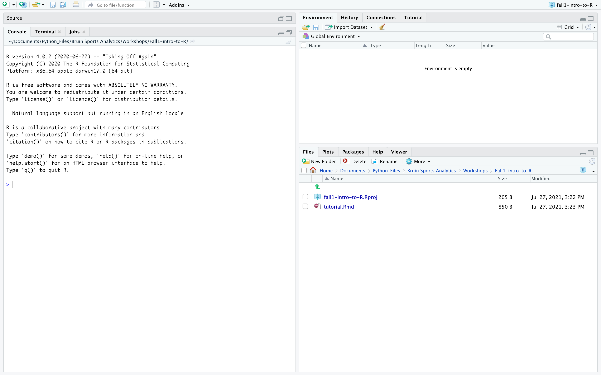

# Tutorial: Introduction to R

## Overview 

1. Installing R
2. Basic Data Types in R
3. Finding Data On Kaggle and Reading it Into R

### 1) Installing R and RStudio

You will need to download R before being able to install and use RStudio on your computer 
The difference:

R: R is a programming language or a software environment as they call it for scientific computing and graphics.

R Studio: This is a IDE (intergrated development environment) for R, which basically allows you to easily write, debug and run your R code. We will be primarily using Rstudio to explore data and generate cool visualizations and reports. 

*Step 1:* Go to https://cran.r-project.org/ and select the correct version for the type of your computer. Then download the file and install it onto your computer

*Step 2:* Go to https://www.rstudio.com/products/rstudio/download/ and select download under the RStudio Desktop Version (the free version). Run the installation of the RStudio. 

*Step 3*: Open RStudio and you should see a screen with three panels.It should look something like this: 


Notice that we have three panels:

- Top Right: In this panel you will be able to see the variables you have created as well as their type, size, length and value
- Bottom Right: These panels has multiple different views but can be used to see your current working directory, the plots that you have created, or any package/help documentation you would like to read 
- The Left Panel: This is currently the console in which you can write R code, however this code is not saved. In order to save the code you will need to create a new file. 

Let's now go ahead and create a new R file. There are two main types of R files you will need to know:

1. R Script (.R) - An R Script file can be used to write and run code/commands 
2. R Markdown (.Rmd) - An Rmarkdown file can also be used to write code and run code but it can be combined with regular text sections to form a notebook type document. You can knit your RMarkdown files into PDF or HTML documents with your code output displayed and easily shared with others 

We will first work with RScript Files. Go ahead and create a new R Script file by going to File --> New File --> R Script

Your screen should now be divided into 4 panels with your RScript file now in the top left corner. 

### 2) Basic Data Types/Structures

There are 3 basic data-types that you should know when using R:
1. Character - These are characters or collection of characters that are denoted with quotes
```{r}
string1 <- "Bruin Sports Analytics" # assigning the string Bruin Sports Analytics to Variable string1
string1
typeof(string1) # using the typeof function we identify the data type of a variable 
```

2. Numeric (Integer and Double) - These are numbers 

```{r}
numeric1 <- 5L
numeric2 <- 5.5
typeof(numeric1)
typeof(numeric2)
mode(numeric1) # this function tells us the how R internally stores our variable
mode(numeric2)
```

3. Logical - These are boolean values (i.e. True or False) 

```{r}
bool1 <- TRUE
bool2 <- FALSE
typeof(bool1)
typeof(bool2)
```

We can convert between these data-types using casting functions. (as.{type}) 

```{r}
num1 <- 5
chr1 <- as.character(num1)

#notice the difference in how num1 and chr1 are printed to the screen
num1
chr1
typeof(num1)
typeof(chr1)
```

```{r}
bool1 <- TRUE
num1 <- as.numeric(bool1)
chr1 <- as.character(bool1)

#notice the difference in how each are printed to the screen
bool1
num1 # note: TRUE gets converted into a 1 and FALSE gets converted into a 0
chr1


typeof(bool1)
typeof(num1)
typeof(chr1)
```


```{r}
# It is not always possible to cast however. 
# For example if we try to cast the string "Hi" into numeric we will get an NA
# This is because R won't know how to convert it to a number
as.numeric('Hi')
```


There are 5 basic data structures that you should know when using R:

1. Vectors 
2. Matrices
3. Factors 
4. Lists 
5. Data-Frame 

There is obviously a lot of theory behind these data-types but I will be giving a brief introduction of what they are, the types of things they can store and basic things you can do with them

#### Vectors

A vector (or an atomic vector) is the most basic data structure in R and can hold several values. 

One thing to note is that a vector contains values that are all of the same data type

```{r}
vector1 <- c(1,2,3) # use the c() to create a vector 
vector1
vector2 <- c(1, "BSA") # if you put values of different datatype then R coerces the vector
vector2
```

As we can see in the demonstration above, in vector2 R coerces the value of 1 from an numeric type to a character type so that the resulting vector contains all values of the same type. 

In general, R coerces vectors along the mode hierachy (which is Character, Numeric and Logical from top to bottom)
This basically means that if you have any logical values in a vector with a numeric or character values then the logical value will coerced to the respective data type. 

We can also access particular values of a vector using subseting methods. 

```{r, error= TRUE}
vector1[1] # a positive index e.g. 1 will return the first value in the vector 

vector1[-1] # a negative index e.g. -1 will return all values except the first one

vector1[c(1,3)] # we can also subset using a vector, here we will get the first and third values


# Note you cannot mix positive and negative indicies 

vector1[c(-1, 2)] # this will produce an error


```

Apart from subseting you can perform operations/functions on all elements within a vector using simple vectorized functions. 

A function or operation is vectorized if it returns a vector of the same length that was inputted with the operation/function applied to all values in the initial vector.

```{r}
vector1 + 1 # adding 1 to all elements within the vector (note: vector1 is not modified since we have not reassigned it)


# we can also apply functions to summarise values within the vector 

mean(vector1) # finds the mean of all values within vector1

```

This is simple basic overview about vectors. There is a lot more to understand but these are some of the fundamentals that will help you get started with exploring datasets 

#### Matricies

A Matrix is a 2D-vector. A matrix consists of rows and columns. Since a matrix is a 2D-vector it can also only store values of the same type. 

```{r}
A <- matrix(c(1,2,3,4,5,6), nrow = 2, ncol = 3, byrow = TRUE) # use the matrix function to create a matrix
A
```

We can subset a matrix in few ways:

1. Using 2D Indicies 

Since a matrix is a 2D vector we can put in the [row,col] to access the value we want
```{r}
A[2,3] # access the 2nd row and 3rd column value

A[2,] # access the entire 2nd row

A[,3] # access the entire 3rd column
```

2. Using Single Dimension Indicies

We can also access the values using a single dimension index. Since matrices are stored as vectors in the order of their columns under the hood if we access the values using a single dimension index we will be running through this vector

```{r}
A[3] # notice how we get the value 2 because A internally is stored as c(1,4, 2, 5, 3, 6) cause we go down the columns
```

#### Lists
Lists are another fundamental datatype within R. The main difference between lists and vectors is that lists are flexible in terms of their ability to store elements of differing datatypes 

```{r}
ls <- list(2,3, list(3), 'Hi', TRUE, c("This will coerce everything to a string", 1, FALSE)) # create a list using the list() function
# the third element of ls is a list this is an example of a nested list(i.e. a list within a list)
ls

```

We can extract elements from a list in two main ways:

1. Single square bracket indexing - This subsets the list and always returns a list 

2. Double square bracket indexing - This extracts the underlying data structure in the component

```{r, error=TRUE}
ls[1] # single square brackets returns a list

ls[[1]] # double square brackets returns the underlying data structure 

ls[c(1,3)] # with single square brackets you can subset multiple elements

ls[[c(1,3)]] # this does not work for double square brackets and will throw an error as you can only extract one element at a time

```

We can also name elements in a list and then access them by their name

```{r}
names(ls) # right now there are no names in our list

names(ls) <- letters[1:6] # we will add the first 6 letters as the names for our list

ls

# Now we can access these elements by name

ls$d # Extracts the element with name d (similar to double square brackets)

ls['a'] # subsets the list to return only the 'a' component
ls[c('a', 'd')]
```


#### Dataframes

Data-frames can be thought of 2D lists. More specfically, under the hood data-frames are a list of column vectors 

```{r}
df1 <- data.frame(col1 = c(1,2,3), col2 = c("A",'B','C'), col3 = c(5,6,7)) # create a dataframe using the data.frame() function
df1
```


We can access values, rows and columns using subseting similar to matrices

```{r}
df1$col1 # extracts the column with name col1 - returns a vector
df1[2,3] # returns value from 2nd row and 3rd column
df1[,1] # returns first column, and drops the dataframe structure
```

### 3) Finding data on Kaggle and Reading it into R

What is Kaggle?

Kaggle is a Data Science community where you can find datasets that other people have scrapped and put in a neat csv format or other easy formats that you can download and read onto your computer. 

Kaggle has millions of datasets and is a great resources when looking for relatively clean data to start your data exploration on. You can also view other people's notebooks on Kaggle to get inspiration or ideas on the types of analysis they have performed on the same data sets. 

For someone just starting their journey into Data Science and Sports Analytics, I highly recommend using Kaggle to find your datasets and practice what you learn in these workshops or other classes on this data. This is the best to improve your data journalism skills, while also having actually project experience to show off to potential employers. 

In this tutorial we will be using the olympics dataset from Kaggle to demonstrate how we can use the apply and tapply functions that we have learned to gain insight about this data. 

Loading CSV data into R:

```{r}
df <- read.csv('olympics.csv') # make sure that the csv file is in your working directory if you want refer to it by filename
head(df) # this functions shows the first 5 rows of the data
```


```{r}
# counting the number of bronze, silver and gold medals in our dataset

table(df$Medal) # the table functions takes in a vector and summarise the value counts for the vector 


```


Now it's time for to try and apply the skills you have learned today to a dataset!


